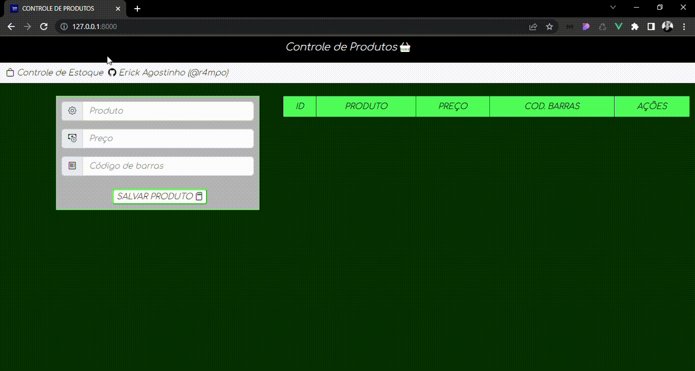

Este é um dos meus primeiros projetos com Laravel, VueJS, Vue-Router e Axios. No caso, dessa vez lhes trago uma SPA - Single Page Application. Basicamente, o objetivo é um simples CRUD - alimentado pela API Rest do Laravel - com links consumidos pelo Axios. Dessa forma, vamos caminhando e estudando. Obrigado a todos que sempre acompanham meus projetos :D

 

    

